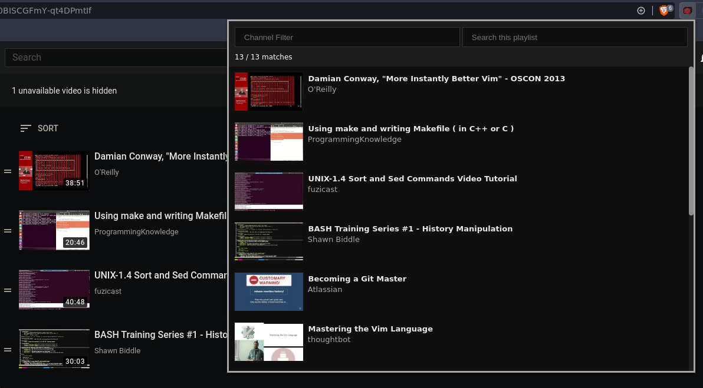
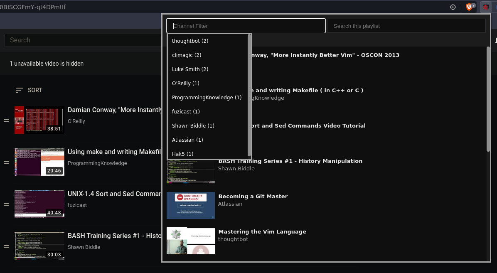

# Youtube Playlist Search

## Donate

### Crypto

Click address for QR code

BTC: [1QCihPNTYRKMhwW6vKjHNkGJkWzR5vdsRp](https://stmhall.ca/btc.png)

ETH: [0xF7A8fed794e5ed89a294b2E6c3f1BcCa03b8ebaC](https://stmhall.ca/eth.png)

LTC: [MMcQLnqeZ6zrfzhLWqwfgoEuKCd5P3ASP4](https://stmhall.ca/ltc.png)

## Description

This started as a copy of the "Playlist Search For YouTube" extension, but I am
cleaning it up and customizing it to my liking.

## Limitations

- You must authenticate with Google when using the extension for the first time
  so that the extension is able to use the YouTube API.
  The YouTube API does not allow access to your "Watch List", so the extension
  will not work on your "Watch List".

## Customizations

- Searching is now more 'fuzzy', so it searches words individually instead of
  together.
- Search by video title
- Searchable channel dropdown
- Videos in the list have a thumbnail
- Removed list.js and jQuery dependencies (jQuery was literally being used for
  list.js and one other thing, and list.js honestly just complicated the script
  more because it just wasn't necessary).
- Cleaned up the code significantly
- Updated and cleaned up CSS
- The UI resembles the YouTube dark theme now.
- Clicking on a video opens the video in a new tab
- Search filter is persistent. The extension will remember the filter you used
  the last time that you did a search for a particular playlist.
- Loading spinner
- Lazy Loading
- Local storage of videos for large playlists for fast retrieval
  - Fetch button to force fetch the playlist from the API

## Installation

I do not have this in the Chrome Extension Store, and I never will. Apparently
Google requires that you pay a $5 registration fee to become an extension
developer now and honestly, I can't be bothered.

So, to install this extension:

* Download, or clone this repository
* For the 'Brave Browser' only, enable the setting "Allow Google login for
  extensions" and restart the browser
* Open the 'Extensions' page in Chrome settings
* Toggle 'Developer mode' on (this should be in the top right corner)
* Click "Load Unpacked"
* Select the folder that this extension was saved as when you cloned or
  downloaded it.

You should have the extension now.

When you use the extension for the first time you will be required to log in to
a Google account. This extension uses Google's YouTube API, and requires a token
from Google that allows the extension to retrieve information from the API.

Optionally, you can now disable "Developer mode". Chrome should keep the custom
version even after disabling.
